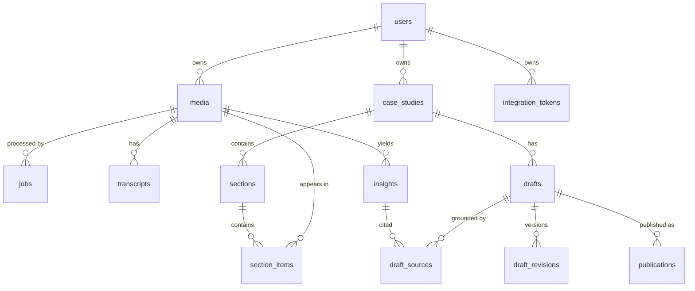

# Data Model

- **Status:** Draft (Sprint 0 baseline; tables land incrementally Sprints 1–4)
- **Related:** [ADR-003](../adr/0003-database-strategy.md), feature specs in [../specs/](../specs/)

## Entity-Relationship Overview

## Tables by Module (ownership per ADR-002)

### shared / auth
- **users** — `id`, `oidc_sub` (unique), `email`, `display_name`, `created_at`, `org_id` NULL (reserved for teams, ADR-006)
- **integration_tokens** — `id`, `user_id`, `provider` (`github`, …), `encrypted_token`, `scopes`, `created_at`, `revoked_at`
- **events** (append-only audit/outbox) — `id`, `type`, `aggregate_type`, `aggregate_id`, `payload` JSONB, `correlation_id`, `created_at`

### ingestion
- **media** — `id`, `user_id`, `kind` (`image|video|audio`), `original_filename`, `mime`, `size_bytes`, `content_hash` (unique per user — dedupe, AC-ING-05), `storage_bucket`, `storage_key`, `status` (`uploading|ready|failed|deleted`), `alt_text` NULL, `width/height/duration_ms` NULL, `created_at`, `updated_at`
- **uploads** (chunked sessions) — `id`, `user_id`, `filename`, `declared_size`, `chunk_size`, `received_chunks` int[], `status`, `idempotency_key` unique, `expires_at`

### jobs (shared pipeline substrate, ADR-005)
- **jobs** — `id`, `type` (`media.probe`, `media.thumbnail`, `media.audio_extract`, `transcribe`, `visual_analyze`, `extract_insights`, `grouping.run`, `draft.generate`, `publish.push`, …), `status` (`queued|running|succeeded|failed|cancelled`), `media_id` NULL, `payload` JSONB, `idempotency_key` unique, `attempts`, `max_attempts` (3), `run_at`, `started_at`, `finished_at`, `last_error` JSONB NULL, `correlation_id`

### analysis
- **transcripts** — `id`, `media_id`, `language`, `segments` JSONB (`[{start_ms, end_ms, text}]`), `provider`, `schema_version`
- **insights** — `id`, `media_id`, `kind` (`decision|outcome|problem|technique`), `text`, `confidence` (0–1), `source_span` JSONB NULL, `edited_by_user` bool, `created_at`, `updated_at`
- **analyses** (visual) — `id`, `media_id`, `summary`, `ocr_text` NULL, `suggested_alt_text`, `elements` JSONB NULL, `provider`, `schema_version`

### composition
- **case_studies** — `id`, `user_id`, `title`, `status` (`organizing|drafting|review|published`), `grouping_score` JSONB NULL (rubric), `created_at`, `updated_at`
- **sections** — `id`, `case_study_id`, `kind` (`context|goals|process|decisions|outcomes|gallery|unsorted|custom`), `title`, `position`
- **section_items** — `section_id`, `media_id`, `position`, `rationale` JSONB NULL, `placed_by` (`ai|user`)
- **drafts** — `id`, `case_study_id`, `current_revision_id`, `score` JSONB NULL (rubric), `status` (`generating|ready|approved`)
- **draft_revisions** — `id`, `draft_id`, `markdown`, `front_matter` JSONB, `created_by` (`ai|user`), `guidance` text NULL, `created_at`
- **draft_sources** — `draft_revision_id`, `claim_span`, `media_id` NULL, `insight_id` NULL, `transcript_span` JSONB NULL

### publishing
- **publishing_targets** — `id`, `user_id`, `type` (`export|git`), `config` JSONB (repo, branch, path), `created_at`
- **publications** — `id`, `draft_id`, `target_id`, `status` (`queued|running|succeeded|failed|retracted`), `external_ref` (commit SHA/PR URL), `published_revision_id`, `idempotency_key` unique, `created_at`, `updated_at`

## Storage Pointers (ADR-003)

- Originals: `s3://<bucket>/<env>/<user_id>/<media_id>/<filename>`
- Derived: `…/<media_id>/derived/<artifact>` (thumbnails, extracted audio)
- DB stores `storage_bucket` + `storage_key`; binaries never in Postgres.

## Conventions

- ULIDs/UUIDs for all primary keys; `created_at/updated_at` everywhere; soft delete via `status`/`deleted_at` where user-visible.
- JSONB payloads carry `schema_version`; anything queried gets a real column + index.
- Row-level security on user-owned tables (defense in depth, ADR-006).
