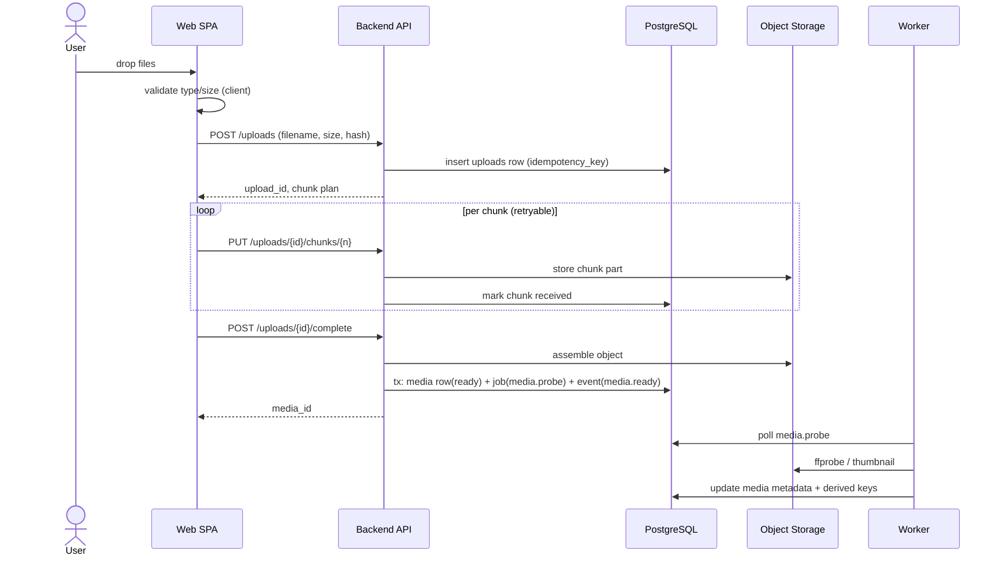
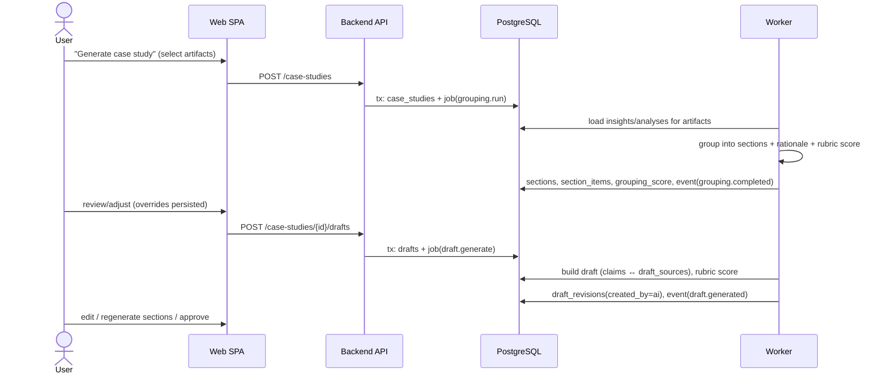

# Sequence Diagrams

- **Status:** Draft (Sprint 0 baseline)
- **Related:** [ADR-004](../adr/0004-ai-orchestration-pattern.md), [ADR-005](../adr/0005-media-processing-pipeline.md), [ADR-010](../adr/0010-publishing-integration-model.md)

## 1. Chunked Upload (Sprint 1)



## 2. AI Analysis (Sprint 2)

```mermaid
sequenceDiagram
    participant DB as PostgreSQL
    participant W as Worker
    participant GW as AI Gateway
    participant AI as Provider
    participant SPA as Web SPA

    DB->>W: job(transcribe | visual_analyze) [media.ready]
    W->>DB: status=running, event(analysis.started)
    W->>GW: provider request (media ref)
    GW->>AI: call (rate-limited, authed)
    AI-->>GW: result / error
    GW-->>W: validated response (+ tokens, cost)
    alt success
        W->>DB: tx: transcripts/analyses rows + job(extract_insights)
    else transient failure
        W->>DB: retry with backoff (attempts<3)
    else permanent failure
        W->>DB: status=failed, event(analysis.failed, reason)
    end
    W->>DB: job(extract_insights) → insights rows
    SPA->>DB: (via API) poll GET /jobs?media_id=…
    Note over SPA: status timeline updates; retry button on failed
```

## 3. Grouping → Draft (Sprint 3)



## 4. Publishing (Sprint 4)

```mermaid
sequenceDiagram
    actor U as User
    participant SPA as Web SPA
    participant API as Backend API
    participant DB as PostgreSQL
    participant W as Worker
    participant G as Git Host

    U->>SPA: Publish
    SPA->>API: POST /drafts/{id}/publish/dry-run
    API-->>SPA: file list + diff
    U->>SPA: confirm
    SPA->>API: POST /drafts/{id}/publish (idempotency_key)
    API->>DB: tx: publications(queued) + job(publish.push)
    W->>W: render bundle (index.md + media + alt text)
    W->>G: commit / open PR (minimal-scope token)
    G-->>W: SHA / PR URL
    W->>DB: publications(succeeded, external_ref), event(publication.published)
    SPA-->>U: link to commit/PR
    Note over U,G: Retract = follow-up job removing content; recorded as retracted
```

## Event Payloads (versioned, bus-compatible)

| Event | Key fields |
|---|---|
| `media.ready` | `media_id`, `user_id`, `kind`, `storage_key`, `schema_version` |
| `analysis.started/succeeded/failed` | `job_id`, `media_id`, `type`, `error?`, `schema_version` |
| `grouping.completed` | `case_study_id`, `score`, `schema_version` |
| `draft.generated` | `draft_id`, `revision_id`, `score`, `schema_version` |
| `publication.published/retracted` | `publication_id`, `target`, `external_ref`, `schema_version` |
