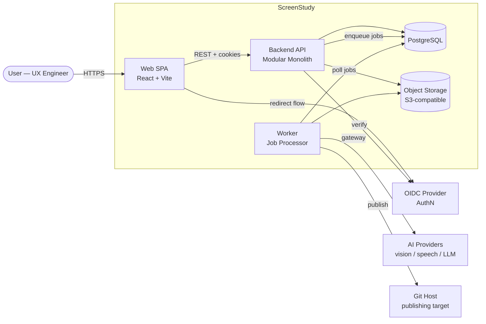

# System Overview (C4 Level 1 — System Context)

- **Status:** Draft (Sprint 0 baseline)
- **Related:** [ADR-002](../adr/0002-backend-architecture.md), [ADR-003](../adr/0003-database-strategy.md), [ADR-004](../adr/0004-ai-orchestration-pattern.md)

## Context

## Key Flows (summary)

1. **Ingestion:** SPA → chunked upload → API → object storage + `media`/`jobs` rows (atomic) → `media.ready` event.
2. **Analysis:** worker picks jobs → transcribe / visual analyze / extract insights → normalized rows → status events.
3. **Composition:** grouping job → sections → draft job → versioned draft with source references.
4. **Publishing:** explicit user action → dry-run diff → publish job → Git adapter → publication record.

Full step-by-step flows: [sequence-diagrams.md](sequence-diagrams.md).

## Container Notes

| Container | Tech (per ADRs) | Responsibilities |
|---|---|---|
| Web SPA | React, Vite, TS, Radix, Tailwind | All user interaction; talks only to Backend API |
| Backend API | Node.js, Fastify, TS | AuthN/Z, CRUD + OpenAPI endpoints, transactional job enqueue |
| Worker | same codebase, separate entrypoint | Media processing (ffmpeg), AI gateway calls, grouping/drafting/publishing jobs |
| PostgreSQL | 16+ | Metadata, job queue, drafts, audit/event log |
| Object storage | S3-compatible (MinIO locally) | Original + derived media; signed-URL access only |

## Deployment Environments

PR preview → staging (auto from `main`) → production (tagged, manual approval) — see [ADR-007](../adr/0007-ci-cd-pipeline.md) and [operations/ci-cd](../operations/ci-cd.md).

## Evolution Path (Plan B)

Each module (`ingestion`, `analysis`, `composition`, `publishing`) is extractable into a service because boundaries are enforced: own tables, service interfaces, domain events, storage abstraction. Triggers and thresholds: [NFR §6](../specs/non-functional-requirements.md).
