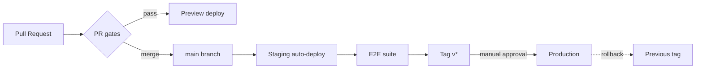

# CI/CD Release Flow

- **Status:** Draft (Sprint 0 baseline)
- **Related:** [ADR-007](../adr/0007-ci-cd-pipeline.md), [ADR-009](../adr/0009-performance-budgets-observability.md)

## Pipeline Overview

## PR Gates (required checks, ADR-007)

1. Lint + typecheck (frontend, backend)
2. Unit + worker tests (recorded AI fixtures — no live provider calls in CI)
3. Contract tests (OpenAPI conformance, provider/event schemas)
4. Build + bundle-size budget (≤ 200 KB gz, NFR-P2)
5. axe accessibility checks on key routes (NFR-A5)
6. Security: dependency scan, secrets scan, CodeQL (NFR-S5)
7. Preview deploy succeeds and is smoke-tested

## Branch & Release Policy

- Trunk-based: short-lived branches → PR → squash merge to `main`.
- Branch protections on `main`: required reviews (1), required checks above, linear history, no force-push.
- Releases: semantic tags `vX.Y.Z` from `main`; release notes reference shipped specs (traceability, see [docs hub](../README.md)).

## Environments

| Env | Trigger | Data | Purpose |
|---|---|---|---|
| Preview (per PR) | PR opened/updated | Seeded fixtures | Review + Lighthouse CI |
| Staging | merge to `main` | Synthetic reference dataset | E2E gate, soak |
| Production | tag + manual approval | Real user data | Beta (from Sprint 5) |

## Database Migrations

Versioned, forward-only, applied as a deploy step before app rollout; rollback = previous app version + compensating migration if needed (see [runbooks](runbooks.md)).

## Secrets & Config

Environment-scoped secrets in the platform secret store; CI uses OIDC federation to deploy (no long-lived cloud keys); secrets scanning blocks commits with credentials (NFR-S5).

## Plan B Evolution

Multi-service pipelines = same stages replicated per service with staged promotion; contracts tested at service boundaries. Only if the [NFR §6](../specs/non-functional-requirements.md) gate triggers.
